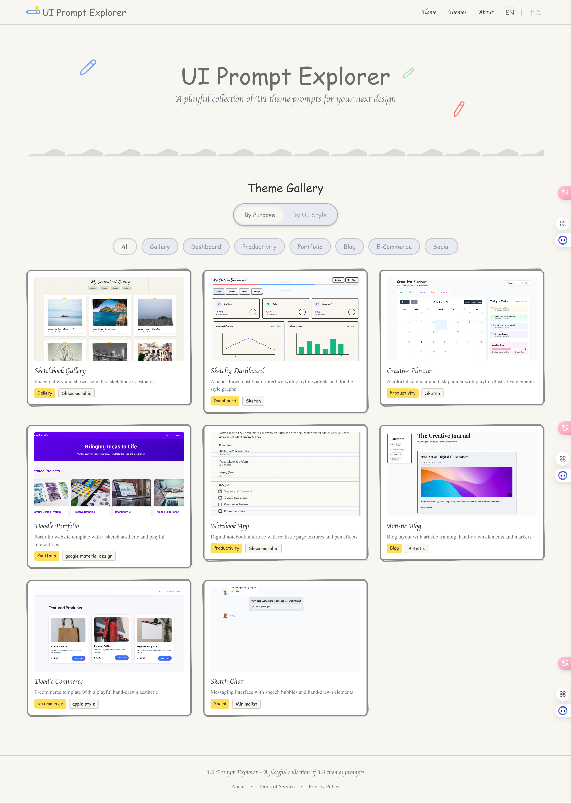

# UI设计灵感库 | UI Style Showcase

一个展示各种UI设计风格的交互式灵感库，帮助设计师和开发者快速找到合适的界面设计风格。



## 项目特色

### 🎨 丰富的设计风格
- **现代简约 (Modern Minimal)** - 类似 Vercel、shadcn/ui 的现代设计
- **新粗野主义 (Neobrutalism)** - 大胆的颜色和几何形状
- **玻璃拟态 (Glassmorphism)** - 透明效果和模糊背景
- **苹果设计 (Apple Design)** - 精致的macOS风格
- **材料设计 (Material Design)** - Google的设计语言
- **复古风格 (Windows 98)** - 经典的系统界面风格
- **微软现代 (Metro/Fluent)** - 现代的微软设计语言
- **扁平化设计 (Flat Design)** - 纯净的扁平化风格

### 🚀 完全前端架构
- **无后端依赖** - 纯前端应用，无需服务器
- **静态部署** - 可部署到任何静态托管平台
- **快速加载** - 所有资源本地化，加载速度快
- **离线友好** - 支持离线浏览和使用

### 🔍 智能搜索功能
- **实时搜索** - 支持风格名称、描述、标签等多维度搜索
- **键盘导航** - 支持方向键和回车键快速操作
- **无需后端** - 基于前端算法的智能搜索

### 🎯 交互式演示
- **实时预览** - 同一界面在不同风格下的对比展示
- **自动播放** - 3秒自动切换风格，展示差异
- **手动控制** - 支持暂停、重置和手动切换

## 技术栈

- **框架**: React 18 + TypeScript
- **构建工具**: Vite
- **样式**: Tailwind CSS
- **UI组件**: Shadcn UI (Radix UI)
- **路由**: React Router DOM
- **国际化**: React i18next
- **包管理**: pnpm

## 项目架构

### 独立风格系统
每个设计风格都有独立的HTML文件，避免样式冲突：
```
public/styles/
├── modern-minimal.html      # 现代简约风格
├── neobrutalism.html        # 新粗野主义风格
├── glassmorphism.html       # 玻璃拟态风格
├── windows98.html           # Windows 98风格
├── metro-fluent.html        # 微软现代风格
├── flat-design.html         # 扁平化设计
└── styles-config.json       # 风格配置文件
```

### 组件化架构
```
src/
├── components/              # 可复用组件
│   ├── ui/                 # 基础UI组件
│   ├── StyleViewer.tsx     # 风格查看器
│   ├── StylePreviewDemo.tsx # 首页演示组件
│   └── GlobalSearch.tsx    # 全局搜索组件
├── data/                   # 数据处理
│   ├── themes.ts          # 主题数据
│   └── stylesLoader.ts    # 风格加载器
├── hooks/                  # 自定义Hook
├── i18n/                   # 国际化配置
└── pages/                  # 页面组件
```

## 风格扩展计划

### 🎯 目标：200+ 设计风格

#### 第一批：经典风格 (已完成)
- ✅ Windows 98 - 复古系统风格
- ✅ Metro/Fluent - 微软现代设计
- ✅ Flat Design - 扁平化设计
- ✅ Modern Minimal - 现代简约
- ✅ Neobrutalism - 新粗野主义

#### 第二批：现代潮流 (计划中)
- 🔄 Neumorphism - 新拟物化
- 🔄 Dark Mode - 深色主题
- 🔄 Cyberpunk - 赛博朋克风格
- 🔄 Retro Wave - 复古波浪
- 🔄 Minimalist Japanese - 日式极简

#### 第三批：艺术风格 (计划中)
- 🔄 Watercolor - 水彩画风格
- 🔄 Sketch/Hand-drawn - 手绘风格
- 🔄 Pixel Art - 像素艺术
- 🔄 Grunge - 垃圾摇滚风格
- 🔄 Vintage - 复古风格

详见 [风格扩展计划](./docs/style-expansion-plan.md)

## 快速开始

### 环境要求
- Node.js (v18+)
- pnpm (推荐)

### 安装运行
```bash
# 克隆项目
git clone https://github.com/yourusername/UIStyleShowcase.git
cd UIStyleShowcase

# 安装依赖
pnpm install

# 启动开发服务器
pnpm dev

# 打开浏览器访问 http://localhost:5173
```

### 生产构建
```bash
pnpm build
```

## 开发工具

### 风格管理工具
```bash
# 添加新风格
node scripts/manage-styles.cjs add

# 列出所有风格
node scripts/manage-styles.cjs list

# 设置默认风格
node scripts/manage-styles.cjs set-default <style-id>
```

### 项目特点
- 📱 **响应式设计** - 适配所有设备尺寸
- 🌐 **国际化支持** - 中英文双语界面
- 🎨 **主题切换** - 实时预览不同设计风格
- 🔍 **智能搜索** - 快速找到所需风格
- 📦 **无依赖部署** - 可部署到任何静态托管平台

## 贡献指南

欢迎贡献新的设计风格！请参考 [风格扩展计划](./docs/style-expansion-plan.md) 了解详细的贡献流程。

## 许可证

[MIT](LICENSE)

---

> 💡 **设计理念**: 每个设计风格都是一个独立的艺术品，通过对比展示帮助用户快速理解不同风格的特点和应用场景。
