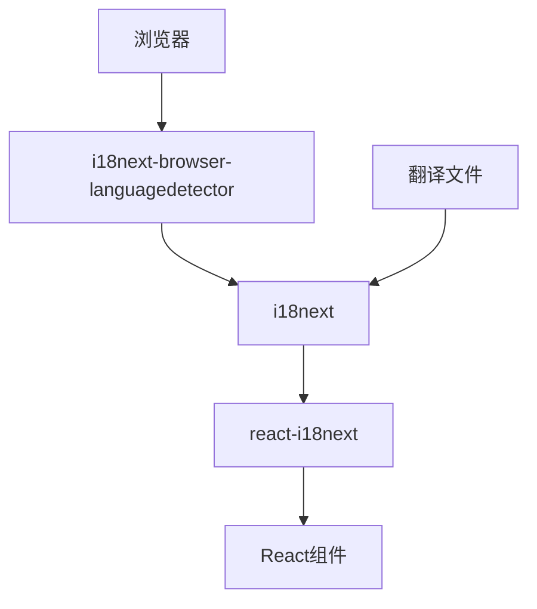

# UI Prompt Explorer 多语言实现指南

本文档提供了关于如何在UI Prompt Explorer项目中添加和管理多语言支持的指南。项目使用React和i18next来实现国际化（i18n）功能。

## 目录

- [架构概览](#架构概览)
- [当前支持的语言](#当前支持的语言)
- [文件结构](#文件结构)
- [添加新语言](#添加新语言)
- [更新组件](#更新组件)
- [最佳实践](#最佳实践)

## 架构概览

项目使用以下库来实现国际化：

- **i18next**: 核心国际化框架
- **react-i18next**: React的i18next绑定
- **i18next-browser-languagedetector**: 用于检测用户浏览器语言

整体架构如下：



## 当前支持的语言

项目目前支持以下语言：

| 语言代码 | 语言名称 |
|---------|---------|
| en      | 英语    |
| zh      | 中文    |

## 文件结构

国际化相关文件的结构如下：

```
src/
├── i18n/
│   ├── i18n.ts            # i18next配置
│   ├── index.ts           # 导出函数
│   ├── types.d.ts         # 类型声明
│   └── locales/           # 翻译文件目录
│       ├── en.json        # 英文翻译
│       └── zh.json        # 中文翻译
└── hooks/
    └── useI18n.ts         # 自定义i18n钩子
```

## 添加新语言

要添加新语言，请按照以下步骤操作：

### 1. 创建新的翻译文件

在`src/i18n/locales/`目录下创建一个新的JSON文件，以语言代码命名（例如`ja.json`用于日语）：

```json
{
  "header": {
    "home": "ホーム",
    "about": "について",
    "themes": "テーマ"
  },
  // 其他翻译键...
}
```

翻译文件应该与现有的`en.json`结构完全相同，只是值被翻译为目标语言。

### 2. 更新i18n配置

在`src/i18n/i18n.ts`文件中添加新语言：

```typescript
// 导入翻译
import enTranslation from './locales/en.json';
import zhTranslation from './locales/zh.json';
import jaTranslation from './locales/ja.json'; // 添加新语言

// 翻译资源
const resources = {
  en: {
    translation: enTranslation
  },
  zh: {
    translation: zhTranslation
  },
  ja: {
    translation: jaTranslation  // 添加新语言
  }
};
```

### 3. 更新语言切换器组件

在`src/components/LanguageSwitcher.tsx`中添加新语言的切换按钮：

```tsx
// 现有代码
<button 
  className={`px-2 py-1 rounded-full transition-all ${
    currentLanguage === 'zh' 
      ? 'bg-doodle-paper shadow-inner text-doodle-pencil' 
      : 'text-doodle-pencil/60 hover:bg-white/50'
  }`}
  onClick={() => changeLanguage('zh')}
>
  中文
</button>

// 添加新语言按钮
<span className="text-doodle-pencil/40">|</span>
<button 
  className={`px-2 py-1 rounded-full transition-all ${
    currentLanguage === 'ja' 
      ? 'bg-doodle-paper shadow-inner text-doodle-pencil' 
      : 'text-doodle-pencil/60 hover:bg-white/50'
  }`}
  onClick={() => changeLanguage('ja')}
>
  日本語
</button>
```

### 4. 更新HTML语言链接

在`index.html`中添加新语言的替代链接：

```html
<link rel="alternate" hreflang="en" href="?lang=en" />
<link rel="alternate" hreflang="zh" href="?lang=zh" />
<link rel="alternate" hreflang="ja" href="?lang=ja" /> <!-- 添加新语言 -->
<link rel="alternate" hreflang="x-default" href="/" />
```

## 更新组件

所有需要支持多语言的文本应该使用`t`函数包装，如下所示：

```tsx
import { useTranslation } from 'react-i18next';

const MyComponent = () => {
  const { t } = useTranslation();
  
  return (
    <div>
      <h1>{t('some.translation.key')}</h1>
      <p>{t('another.key')}</p>
    </div>
  );
};
```

如果需要将变量动态传递给翻译，可以使用：

```tsx
t('welcome.message', { name: userName })
```

然后在翻译文件中：

```json
{
  "welcome": {
    "message": "欢迎，{{name}}！"
  }
}
```

## 翻译文件结构

翻译文件采用嵌套的JSON结构，按功能和页面组织。以下是主要的顶级类别：

- `header`: 导航栏相关
- `hero`: 主页英雄区域
- `gallery`: 主题画廊相关
- `theme`: 主题卡片相关
- `filter`: 过滤器相关
- `style`: 样式过滤器相关
- `footer`: 页脚相关
- `about`: 关于页面相关
- `themeDetail`: 主题详情页相关
- `notFound`: 404页面相关

确保新添加的翻译文件包含所有这些类别和它们下面的所有键。

## 最佳实践

1. **使用命名空间**：保持翻译键的组织性，使用点表示法（如`page.section.element`）
2. **默认值**：在使用`t`函数时，为特殊情况提供默认值：
   ```tsx
   t(`filter.${category}`, {defaultValue: category})
   ```
3. **参数化翻译**：对于包含变量的文本，使用参数化翻译而不是字符串拼接
4. **组织翻译**：按页面和功能组织翻译键，保持层次结构一致
5. **保持翻译文件同步**：确保所有翻译文件都包含相同的键（即使值不同）

---

按照本指南添加新语言后，网站将能够在支持的语言之间无缝切换，并为用户提供本地化的体验。 